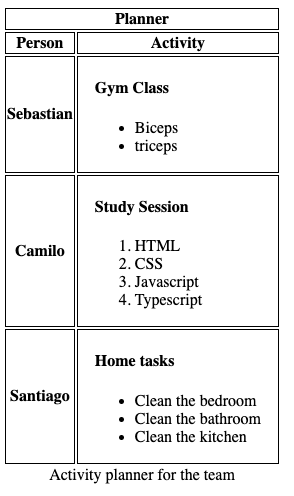

# DAY 5
## Table is what I'm going to give you ... day

1. lists and types
    - HTML lists (inside the lists and types node)
    - Ordered lists
        - ol: The Ordered List element
        - li: The List Item element
    - Unordered lists
        - ul: The Unordered List element
    - Definition lists
        - <dl>: The Description List element
        - <dd>: The Description Details element
    - Nested lists
        - How to Create Nested Lists in HTML: A Simple Guide

2. table tag
    - table: The Table element (inside the table tag node)

## Task

Design a weekly planner that utilizes an HTML table format. The table should feature the weekdays as columns and the hours of the day as rows. Within the table cells, include either unordered or ordered lists to outline subtasks associated with major tasks, similar to the example shown in the image provided. Each day should contain at least three tasks, described in detail using lists.

the table should contain a bottom caption and a table header row that spans the entire width of the table (like the planner header in the image).

you should use only 1 file for the task (CSS external files are not allowed)

